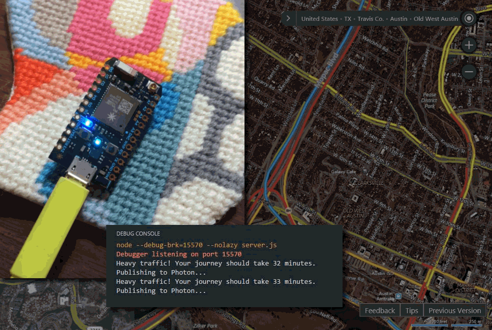

# IoT4ETA
````
IoT4ETA ("Internet of Things 4 Estimated Time of Arrival")

Make a tiny, internet-connected lantern that alerts you about current traffic on your commute.

Suitable for beginners! Easy! Adaptable! Fun! Non-toxic!
````



## Overview and purpose

IoT4ETA brings together a [Particle Photon](http://particle.io) microcontroller and the [Bing Maps Routes API](https://msdn.microsoft.com/en-us/library/ff701713.aspx) to give you real-time traffic updates about a given driving commute. In this project, the Photon's on-board blue LED flashes at varying rates to indicate little, moderate, or severe traffic delays. The start and endpoints of the driving route and traffic delay tolerances are customizable.

**While IoT4ETA might help you beat Friday afternoon gridlock, its true *raison d'etre* is to serve as a template for bringing information from the web into the physical world via IoT devices and [node.js on Azure](https://azure.microsoft.com/en-us/develop/nodejs/).** The methods used in this simple project can be reproduced to tap into the vast data made available through web APIs and to create from them meaningful physical manifestations.


## How does it work?
So glad you asked! The IoT4ETA repository contains three key files:
  - ``server.js`` is the node application. There are some values at the top of the file that you can customize with your travel route and other preferences. At regular intervals, the Routes API will be polled, returning an estimated travel duration that takes the latest traffic into account (``travelDurationTraffic``) and an estimated travel duration that assumes no traffic (``travelDuration``). These two values are compared against the user's personal thresholds for low, moderate, and heavy traffic to assign a ``trafficrating`` of 1, 2, or 3, respectively. This ``trafficrating`` is immediately published to the Photon with the help of Particle's ``particle-api-js`` node module.
  - ``firmware.ino`` is the code that operates on the Photon device. When it receives via WiFi a ``trafficrating`` value from the node application, a certain LED behavior is kicked off (solid on, slow flashing, or rapid flashing).
  - ``package.json`` is a simple configuration file that lists the node dependencies that are needed for local testing or for Azure deployment.
  
In order for the application to work, ``server.js`` must be actively running in node (locally or on a hosted server) and ``firmware.ino`` must be running on a WiFi-connected Photon. This simple project illustrates how easy it is to collect, process, and display REST API data on an IoT device via a node application written in Javascript. Ready to get it running?


## Materials and prerequisites list

- [ ] [Particle Photon](http://particle.io) microcontroller with micro USB-to-USB cable

- [ ] **For local testing of node app:** [node](http://nodejs.org), [git](https://git-scm.com/), [npm](https://www.npmjs.com/) or [bower](http://www.bower.io), and a text editor/IDE such as [Code](http://code.visualstudio.com)

- [ ] **For deployment of node app to Azure:** [Azure account](http://portal.azure.com/) (free trial or paid), [git](https://git-scm.com/) or [GitHub account](http://www.github.com)


## Instructions

1. Set up your Photon and Particle Build account, following the first 7 steps of [Particle's online setup guide](https://docs.particle.io/guide/getting-started/start/photon/). Once the Photon is set up, connect it to power via USB. If correctly connected to WiFi, the Photon should display a gently pulsing cyan light. With the Photon connected to WiFi, log in to the [Particle Build IDE](http://build.particle.io). On the left sidebar, choose Devices (the crosshair) and confirm that your device appears in the list and is online. *Hint: If you've registered more than one Photon device, be sure to choose your active device by clicking the star to the left of its name.* Finally, choose Settings (the gear) and make note of your access token.

2. Register for a [Bing Maps developer account](http://bingmapsportal.com) to get access to the Bing Maps Routes API and an API key (free for most small, non-commercial projects). Once you've registered your soon-to-exist app, the API key can be found by choosing My Account > My Keys.

3. **For local testing of node app**: After confirming that prerequisite software is installed, clone the IoT4ETA repository to your local machine and install node dependencies with ``npm install``. This should generate a node_modules folder. Open the file named ``server.js`` in your code editor and modify the values within the section labeled "Customize this data!" *Note: Take care not to post, share, or upload files containing access tokens, passwords, and other sensitive data. Comprimised data should be reset immediately.* You can now run the node app with the command ``node server.js`` or with the node debugging tools in the [Code IDE](http://code.visualstudio.com). If successful, you will see a message printed to the console indicating current traffic on your designated route. If the app does not run, check your credentials and that your start and endpoint variables contain complete addresses.

4. **For deployment of node app to Azure:** To create a new node app in Azure, [Log in to your Azure account](http://portal.azure.com), then select New > Web + Mobile > Web App. Create a name for the app and a new Resource Group. In the App Service plan menu, choose a B1 plan, then click Create. In a few moments, the app will be ready to use. Choose your new app from the App Services menu, then select Settings > Application settings. Make sure Always On is set to On, as this ensures the node server will run continuously. In this same pane, scroll down to the section marked App settings. You will see a pair of boxes labeled Key and Value. These fields are used to securely store sensitive credentials like passwords and tokens. Add four Keys called myparticleemail, myparticlepw, myparticletoken, and mybingmapskey, and for each, enter its corresponding value in the Value box. *Hint: Refer to ``server.js`` for more information about these four variables.* Finally, click Save at the top of this pane and close the pane. In the Settings pane, scroll down to the section titled Deployment source and choose Choose Source.
  - **For deployment from a local git repository:** Clone the IoT4ETA repository to your local machine. Open ``server.js`` and customize the first five variables in the "Customize this data!" section. The final four variables and their values are already stored on Azure, so they can be deleted or commented-out from the ``server.js`` file. Then, complete [these steps for setting up continuous deployment from a local git repository](https://azure.microsoft.com/en-us/documentation/articles/web-sites-publish-source-control/).
  - **For deployment from GitHub:** In a separate browser window, fork the IoT4ETA repository from your GitHub account. Open ``server.js`` and customize the first five variables in the "Customize this data!" section. The final four variables and their values are already stored on Azure, so they can be deleted or commented-out from the ``server.js`` file. Return to Azure and select GitHub. Enter the requested information and select OK.

 Any changes to the repository will now automatically sync to Azure. Syncing can be manually stopped or previous commits can be reinstated through the Azure portal. *Note: When a file named ``server.js`` or ``app.js`` and an accompanying ``package.json`` file are deployed to an Azure Web App, Azure automatically understands it as a node application, installs all dependencies listed in ``package.json``, initiates an instance of node, and runs the Javascript file in node. For this reason, the ``node_modules`` folder can be safely omitted from GitHub or local git repositories.*

5. Return to the [Particle Build IDE](http://build.particle.io) and create a new application. Replace the placeholder text with the contents of ``firmware.ino``, then select Save (the folder icon) and then Verify (the checkmark icon). Once the code successfully compiles, confirm that your Photon is online and flash the code by selecting Flash (the thunderbolt icon). If the node application is running locally or on Azure, you should see the Photon's blue on-board LED correspond with current driving route traffic.


## Conclusion
I hope this has been fun and instructive. Feedback and pull requests are welcome! You can find me on the web ([nobadmemories.com](http://www.nobadmemories.com)) and on twitter ([@partytimeHXLNT](http://www.twitter.com/partytimehxlnt)).
 
 
